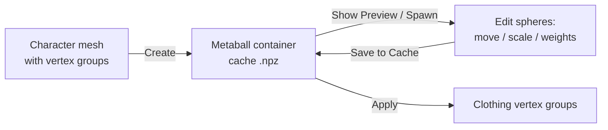

# Metaball Weight Container (MWC) 1.1 — Full Documentation

> **Navigation:** [README (overview)](README.md) · [Полная документация на русском](Full-doc.ru.md)

---

## Table of Contents

1. [What is MWC](#1-what-is-mwc)
2. [Requirements & Installation](#2-requirements--installation)
3. [Workflow Overview](#3-workflow-overview)
4. [Panel Reference](#4-panel-reference)
   - [Main Panel — Cache Status](#41-main-panel--cache-status)
   - [1. Generation & Cache Creation](#42-1-generation--cache-creation)
   - [2. Viewport & Editing](#43-2-viewport--editing)
   - [3. Weight Transfer & Baking](#44-3-weight-transfer--baking)
5. [Parameter Presets](#5-parameter-presets)
6. [Cache System](#6-cache-system)
7. [GPU Preview Internals](#7-gpu-preview-internals)
8. [Performance Guide](#8-performance-guide)
9. [Troubleshooting / FAQ](#9-troubleshooting--faq)
10. [Version History](#10-version-history)

---

## 1. What is MWC

**Metaball Weight Container (MWC)** is a specialized tool for Blender designed for precise and rapid transfer of rigging weights from a character onto clothes, accessories, shoes, and other companion objects.

Unlike standard Blender weight-transfer tools (such as *Data Transfer*), which project weights directly from surface to surface and often cause weight "bleeding" (e.g., from the torso onto sleeves or between fingers), MWC uses a **volumetric approach**:

1. **Metaball Container Generation** — the source character mesh is converted into a volumetric cloud of virtual spheres (metaballs), each storing the weights of the influencing bones.
2. **Display and Editing** — position, radius, and weights of the spheres can be adjusted in real time, letting you evaluate deformation quality directly in Pose Mode.
3. **Smart Weight Transfer** — weights are transferred to the target clothing using mesh-edge geodesic distances, normal filtering, and final Laplacian smoothing.

### Why volumetric?

| | Surface projection (Data Transfer) | MWC |
|---|---|---|
| Bleeding between limbs/fingers | Common | Prevented by geodesic distance + thickness-aware spheres |
| Editability of the result | None (recompute only) | Spheres are editable objects — move/scale/reweight, then re-bake |
| Reuse across many garments | Recompute per garment | One container serves dozens of garments via presets |

---

## 2. Requirements & Installation

- **Blender 4.5+** (tested through 5.x).
- **NumPy** — bundled with Blender, no extra install needed.
- No external dependencies.

**Install:** `Edit → Preferences → Add-ons → Install…` and pick the addon ZIP (or copy the `MWC` folder into `scripts/addons/`). Enable **"MWC — Metaball Weight Container"** in the add-on list.

The UI lives in the N-panel of the 3D Viewport under the **MWC 1.1** category.

---

## 3. Workflow Overview

1. **Cache Generation** — select the character in the **Source Mesh** field, adjust sphere scale, click **Create**. The addon generates the sphere cloud and saves it to the cache.
2. **Visualization and Tweaking** — enable **Show Preview** to see the spheres. For precise manual tuning, spawn them as physical objects with **Spawn Viewport Metaballs**, move them, adjust their bone weights on the panel, then click **Save to Cache**.
3. **Transfer to Clothing** — select the target clothing in the **Target Mesh** field, configure transfer parameters, click **Apply**.



---

## 4. Panel Reference

### 4.1 Main Panel — Cache Status

Shows whether a cache exists for the current `.blend`, how many metaballs it holds, and the Alpha value it was generated with. **Clear Cache** deletes the cached `.npz` file.

### 4.2 1. Generation & Cache Creation

This section analyzes the source character mesh, places spheres based on its vertices, and writes the data to the cache.

- **Source Mesh** — the character mesh object with skeletal binding (Vertex Groups containing weights). Metaballs are generated from its geometry.
- **Custom Settings** — unlocks advanced generation settings:
  - **Alpha (Scale)** — base scale for sphere radii. Smaller values make spheres more localized; larger values make them more diffused.
  - **Subdivision Coeff (K)** — edge subdivision coefficient. If a mesh edge is too long, the addon automatically places additional spheres along it to eliminate weight gaps (e.g., on forearms).
  - **Merge Close** — merge closely-spaced spheres of the same bone for optimization.
  - **Merge Factor** — distance threshold for merging.
  - **Joint-Aware Scaling** — adapt sphere radius near joints:
    - **Armature** — the character's armature object.
    - **Joint Scale Factor** — radius multiplier for spheres near joints (bone connections).
    - **Middle Scale Factor** — radius multiplier for spheres in the middle of long bones.
  - **Thickness-Aware Scale** — limit sphere radius by local body thickness (uses raycasting).
    - **Thickness Factor** — thickness multiplier. *Critically important for fingers: prevents spheres from inflating too wide and mixing weights between adjacent fingers.*
- **Grouping**
  - *Single Object* — all spheres form one family. Recommended for seamless clothing.
  - *Multiple Objects* — spheres are split into independent groups by geometric islands of the mesh (useful when buttons, belts, etc., are separate from the body).
- **Symmetry** — generates spheres only on the left side and mirrors them to the right, automatically renaming bones (`.L` ↔ `.R`).
- **Create** — runs generation and writes spheres to the cache.
- **Load Preset / Save Preset** — see [Parameter Presets](#5-parameter-presets).

### 4.3 2. Viewport & Editing

Dedicated to weight previewing and manual correction.

***Viewport Object Controls***
- **Spawn Viewport Metaballs** — spawns spheres from the cache into the scene as real Blender metaball objects (under the `MWC_Metaballs` collection). They can be moved, scaled, and edited with standard tools.
- **Clear Viewport Metaballs** — safely deletes spawned metaball objects without touching the saved cache file.

***Viewport Preview (GPU Rendering)***
- **Show Preview** — enables the GPU-rendered real-time preview of the spheres in the 3D Viewport. Spheres follow skeletal deformation in Pose Mode.
- **Color by Active Bone** — spheres are colored with a Weight-Paint gradient (blue → red) according to the weights of the currently selected bone / vertex group.
- **Clean Look** — to reduce visual noise, the wireframe grid is drawn in gold **only on the selected sphere**; all others render as clean, smooth semi-transparent volumes.

***Active Metaball Editor***
Displays properties of the currently selected metaball object from `MWC_Metaballs`:
- **Add Metaball** — adds a new sphere at the 3D cursor.
- **Snap to Cursor** — snaps the selected sphere to the 3D cursor.
- **Alpha** — radius slider for the selected sphere.
- **Bone Weights** — list of bones and their numeric weights (0.0–1.0) assigned to the selected sphere. Adjust with sliders, delete with the cross button, or type a new bone name and press plus.
- **Save to Cache** — overwrites the `.npz` cache file with current positions, scales, and bone weights of the edited viewport spheres.

### 4.4 3. Weight Transfer & Baking

Controls calculation of sphere influence on clothing vertices and final baking.

- **Target Mesh** — the clothing/accessory mesh object that receives the weights.
- **Custom Settings**:
  - **Geodesic Distance** — uses distance along mesh edges (Dijkstra) instead of straight Euclidean distance. *Prevents weight bleeding in tight areas (torso → resting arm, between fingers).*
    - **Geodesic Performance Mode**:
      - *Sequential* — single-threaded, safest.
      - *Thread Pool* — parallel multi-threaded computation (recommended, works on all OSes).
      - *Process Pool* — multi-process computation (fastest on many-core CPUs for heavy 100k+ vertex meshes; automatically falls back to sequential if the environment cannot spawn processes).
  - **Custom Falloff Curve** — manually shape the influence falloff with Blender's curve editor (a curve-mapping node is created for you).
  - **Wyvill Exponent (n)** — falloff power in the classic Wyvill formula (used when the custom curve is off). Higher = sharper sphere boundaries.
  - **Mixing Exponent (q)** — sharpness of blending between overlapping spheres.
  - **Threshold (tau)** — micro-weight cutoff; weights below this are removed to keep the result clean.
  - **R Falloff Coeff** — multiplier on the spheres' maximum influence radius.
- **Normal Filter** — filters weights by how well the clothing vertex normal matches the sphere normal.
  - **Strictness (p)** — higher values penalize mismatched normals more severely.
  - > ⚠️ **Do not enable the Normal Filter if the clothing has thickness (e.g., a Solidify modifier)!** Opposite-facing normals on the inside will cause binding artifacts.
- **Smoothing** — Laplacian weight smoothing across the mesh after transfer.
  - **Smoothing Strength** — strength of the effect.
  - **Smoothing Iterations** — number of passes.
- **Apply** — calculates and bakes weights onto the target clothing.

---

## 5. Parameter Presets

Every generation and transfer parameter can be stored as a named JSON preset and reused later — ideal when one character pipeline feeds dozens of garments.

- **Save Preset** (floppy icon next to Load) — prompts for a name and stores **all** MWC scene parameters (generation + transfer) as JSON.
- **Load Preset** — dropdown listing every saved preset; applying restores all parameters at once.

Presets are stored in the Blender user config:
```
<scripts>/presets/operator/mwc17.preset/<name>.json
```
They are plain JSON files — you can copy them between machines or commit them to your studio pipeline repo. Unknown/missing properties in old presets are skipped gracefully.

---

## 6. Cache System

The metaball container is serialized to an `.npz` file in the system temp directory. Since v1.1 the cache is **per-.blend**: the filename embeds the blend name and a hash of its absolute path, e.g.

```
mwc_metaballs_cache@MyCharacter_1a2b3c4d5e6f.npz
```

Consequences:

- Opening two characters in two Blender instances no longer overwrites each other's cache.
- Unsaved (`untitled.blend`) files share one generic cache — save your file first for isolation.
- The path is stable across Blender restarts and moving the temp directory; it is re-derived after *Save As*.
- **Clear Cache** removes exactly the current blend's cache file.

Priority order when transferring: live `MWC_Metaballs` objects in the scene (they are auto-synced into the cache first) → cache file fallback.

---

## 7. GPU Preview Internals

The viewport preview draws thousands of spheres in real time using a single **instanced GPU shader** built through `GPUShaderCreateInfo`:

- One draw call renders all spheres: per-sphere position/radius/color are instance attributes expanded into a shared UV-sphere vertex stream; index buffers are expanded once per LOD level and cached.
- Three LOD levels are chosen per redraw based on total sphere count, so dense containers stay interactive.
- The wire overlay for the selected sphere is drawn on a separate polyline batch in gold.
- Cached metaballs follow Pose Mode deformation because each stores its coordinate in its dominant bone's local space (`co_local` + `parent_bone`) and is re-transformed per frame.

If the instanced shader cannot be created (driver limitations), the addon falls back to legacy drawing automatically.

---

## 8. Performance Guide

| Scenario | Recommendation |
|---|---|
| Dense source mesh (50k+ verts) | Raise **Alpha**, enable **Merge Close** — fewer, larger spheres transfer faster and smoother |
| Fingers / tight areas | Enable **Thickness-Aware Scale** (factor ≈ 0.5–0.8) + **Geodesic Distance** |
| Thick clothing (Solidify) | Disable **Normal Filter**; rely on geodesic + smoothing |
| Huge target mesh (100k+ verts), many-core CPU | Geodesic mode **Process Pool**; otherwise **Thread Pool** |
| Many garments per character | Save a **preset** per garment type; reuse one container |
| Slow viewport preview | Lower preview density via Merge Close; LOD switching is automatic |

Generation and transfer are NumPy-vectorized; the only Python-level loops scale with the number of metaballs, not vertices.

---

## 9. Troubleshooting / FAQ

**Weights bleed from torso to sleeve / between fingers.**
Enable **Geodesic Distance** and **Thickness-Aware Scale** during generation. Increase Normal Filter strictness only if the clothing is single-sided.

**Artifacts on double-sided (solidified) clothing.**
Turn the **Normal Filter** off — inner-surface normals face opposite directions and get filtered out.

**"Cache not found" after reopening a file.**
The cache is per-.blend and lives in the temp dir; the OS may clean it. Re-click **Create** (it takes seconds), or keep working sessions within the same OS boot. Saved blends always regenerate deterministically.

**Spawned metaballs don't follow the pose.**
Preview spheres follow Pose Mode automatically; spawned META objects follow only if parented (the addon parents them to the dominant bone on spawn). Re-spawn if you moved bones drastically before spawning.

**Apply did nothing / empty vertex groups.**
Check that the target mesh has enough geometry near the character, and that the metaball radii actually reach it — enable **Show Preview** to inspect coverage.

**Process Pool mode fails / hangs.**
Some environments cannot fork processes (sandboxed builds, some Linux setups). The addon detects this and falls back to sequential automatically; switch to Thread Pool for parallelism.

**Preset doesn't apply some fields.**
Presets from older versions may contain renamed properties; unknown keys are skipped and reported in the console.

---

## 10. Version History

### 1.1
- **Parameter presets** — save/load all generation & transfer settings as named JSON presets.
- **Per-blend cache** — each `.blend` gets its own cache namespace (`mwc_metaballs_cache@<blend>_<hash>.npz`); no more cross-instance overwrites.
- **Instanced GPU preview** — single-draw-call sphere rendering with automatic LOD selection; large containers stay interactive.
- **Process Pool geodesic mode** — multi-process Dijkstra for very heavy meshes, with safe fallback.
- Robust identification of MWC metaball objects (custom property flag instead of name prefix matching).
- Numerous fixes: Create button reliability, preset row isolation, cache status sync, translation additions.

### 1.0
- Initial release: metaball container generation, GPU preview, viewport editing, geodesic weight transfer with Wyvill/custom-curve falloff, normal filtering, Laplacian smoothing, symmetry, RU/EN localization.

---

*MWC is written in Russian and English.*
