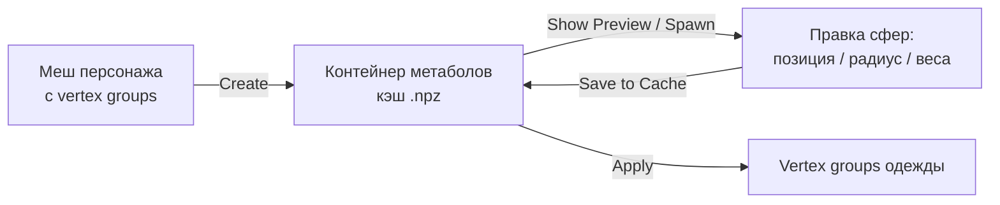

# Metaball Weight Container (MWC) 1.1 — Полная документация

> **Навигация:** [README (обзор)](README.md) · [Full documentation in English](Full-doc.md)

---

## Содержание

1. [Что такое MWC](#1-что-такое-mwc)
2. [Требования и установка](#2-требования-и-установка)
3. [Общий рабочий процесс](#3-общий-рабочий-процесс)
4. [Описание панелей](#4-описание-панелей)
   - [Главная панель — статус кэша](#41-главная-панель--статус-кэша)
   - [1. Генерация и создание кэша](#42-1-генерация-и-создание-кэша)
   - [2. Вьюпорт и редактирование](#43-2-вьюпорт-и-редактирование)
   - [3. Перенос весов и запекание](#44-3-перенос-весов-и-запекание)
5. [Пресеты параметров](#5-пресеты-параметров)
6. [Система кэша](#6-система-кэша)
7. [Устройство GPU-превью](#7-устройство-gpu-превью)
8. [Руководство по производительности](#8-руководство-по-производительности)
9. [Решение проблем / FAQ](#9-решение-проблем--faq)
10. [История версий](#10-история-версий)

---

## 1. Что такое MWC

**Metaball Weight Container (MWC)** — инструмент для Blender, созданный для точного и быстрого переноса весов оснастки (rigging weights) с персонажа на одежду, аксессуары, обувь и другие сопутствующие объекты.

В отличие от стандартных инструментов переноса весов Blender (таких как *Data Transfer*), которые проецируют веса напрямую с поверхности на поверхность и часто допускают «протекание» весов (например, с торса на рукава или между пальцами), MWC использует **объемный подход**:

1. **Генерация контейнера метаболов** — исходный меш персонажа преобразуется в объемное облако виртуальных сфер (метаболов), каждая из которых хранит веса влияющих костей.
2. **Отображение и редактирование** — положение, радиус и веса сфер настраиваются в реальном времени; качество деформации оценивается прямо в Pose Mode.
3. **Умный перенос весов** — веса переносятся на одежду с использованием расстояний по рёбрам сетки (геодезических), фильтрации по нормалям и финального сглаживания Лапласом.

### Почему объемный подход?

| | Проекция по поверхности (Data Transfer) | MWC |
|---|---|---|
| Протекание весов между конечностями/пальцами | Частая проблема | Исключается геодезическим расстоянием и сферами, ограниченными толщиной тела |
| Редактируемость результата | Нет (только пересчёт) | Сферы — редактируемые объекты: двигайте/масштабируйте/меняйте веса и перезапекайте |
| Переиспользование для множества одежды | Пересчёт под каждую вещь | Один контейнер обслуживает десятки вещей через пресеты |

---

## 2. Требования и установка

- **Blender 4.5+** (проверено до 5.x).
- **NumPy** — входит в комплект Blender, дополнительно ставить не нужно.
- Внешних зависимостей нет.

**Установка:** `Edit → Preferences → Add-ons → Install…` и укажите ZIP аддона (или скопируйте папку `MWC` в `scripts/addons/`). Включите **«MWC — Metaball Weight Container»** в списке аддонов.

Интерфейс находится в N-панели 3D Viewport, вкладка **MWC 1.1**.

---

## 3. Общий рабочий процесс

1. **Генерация кэша** — выберите персонажа в поле **Source Mesh**, настройте масштаб сфер и нажмите **Create**. Аддон сгенерирует облако сфер и запишет его в кэш.
2. **Визуализация и правка** — включите **Show Preview**, чтобы увидеть сферы. Для точной настройки заспавньте их как реальные объекты кнопкой **Spawn Viewport Metaballs**, двигайте и меняйте веса вручную, затем нажмите **Save to Cache**.
3. **Перенос на одежду** — выберите целевую одежду в поле **Target Mesh**, настройте параметры переноса и нажмите **Apply**.



---

## 4. Описание панелей

### 4.1 Главная панель — статус кэша

Показывает, существует ли кэш для текущего `.blend`, сколько в нём метаболов и с каким Alpha он был создан. **Clear Cache** удаляет файл кэша.

### 4.2 1. Генерация и создание кэша

Раздел анализирует исходный меш персонажа, расставляет сферы по его вершинам и записывает данные в кэш.

- **Source Mesh (Исходный меш)** — объект-меш персонажа с привязкой к скелету (Vertex Groups с весами). На его основе создаются метаболы.
- **Custom Settings (Свои параметры)** — чекбокс, открывающий расширенные настройки генерации:
  - **Alpha (Scale)** — базовый масштаб радиусов сфер. Меньшие значения делают сферы более точечными, большие — более размытыми.
  - **Subdivision Coeff (K)** — коэффициент разбиения длинных рёбер. Если ребро меша слишком длинное, аддон автоматически расставит вдоль него дополнительные сферы, чтобы исключить пустоты в весах (например, на предплечьях).
  - **Merge Close** — слияние близко расположенных сфер одной кости для оптимизации.
  - **Merge Factor** — порог расстояния для слияния.
  - **Joint-Aware Scaling** — адаптация радиуса в суставах:
    - **Armature** — объект-скелет персонажа.
    - **Joint Scale Factor** — коэффициент радиуса сфер в суставах (сочленениях костей).
    - **Middle Scale Factor** — коэффициент радиуса сфер в середине длинных костей.
  - **Thickness-Aware Scale** — ограничение радиуса сфер по локальной толщине тела персонажа (использует raycast).
    - **Thickness Factor** — множитель толщины. *Критически важно для пальцев рук: предотвращает раздувание сфер и смешивание весов между соседними пальцами.*
- **Grouping (Группировка)**
  - *Single Object (Один объект)* — все сферы сливаются в одно семейство. Рекомендуется для бесшовной одежды.
  - *Multiple Objects (Несколько объектов)* — сферы разделяются на независимые группы по геометрическим островам меша (например, если пуговицы или ремни отделены от тела).
- **Symmetry (Симметрия)** — сферы генерируются только на левой стороне персонажа и зеркально отражаются на правую с автоматическим переименованием костей (`.L` ↔ `.R`).
- **Create (Создать)** — запускает генерацию и записывает сферы в кэш.
- **Load Preset / Save Preset** — см. [Пресеты параметров](#5-пресеты-параметров).

### 4.3 2. Вьюпорт и редактирование

Раздел предварительного просмотра весов и их ручной корректировки.

***Управление объектами в сцене***
- **Spawn Viewport Metaballs** — спавнит сферы из кэша в сцену как реальные объекты Blender (коллекция `MWC_Metaballs`). Их можно двигать, масштабировать и настраивать стандартными инструментами.
- **Clear Viewport Metaballs** — безопасно удаляет заспавненные объекты сфер из сцены, не затрагивая сохранённый файл кэша.

***Viewport Preview (GPU-отображение)***
- **Show Preview (Показать превью)** — включает отрисовку сфер в 3D Viewport силами GPU. Сферы следуют за деформациями костей в Pose Mode.
- **Color by Active Bone** — сферы окрашиваются градиентом весов (от синего к красному) по кости / группе вершин, выделенной сейчас.
- **Чистый вид** — для снижения визуального шума сетка граней рисуется золотым цветом **только на выделенной сфере**, остальные отображаются как чистые полупрозрачные объёмы.

***Редактор активного метабола***
Показывает параметры выделенного метабола из коллекции `MWC_Metaballs`:
- **Add Metaball** — добавляет новую сферу в позицию 3D-курсора.
- **Snap to Cursor** — перемещает выделенную сферу к 3D-курсору.
- **Alpha** — слайдер радиуса выделенной сферы.
- **Bone Weights (Веса костей)** — список костей и их числовых весов (0.0–1.0) для выделенной сферы. Регулируйте слайдерами, удаляйте кнопкой с крестиком или впишите имя новой кости и нажмите плюс.
- **Save to Cache (Сохранить в кэш)** — перезаписывает файл кэша `.npz` текущими позициями, масштабами и весами отредактированных сфер.

### 4.4 3. Перенос весов и запекание

Раздел управляет расчётом влияния сфер на вершины одежды и финальным запеканием.

- **Target Mesh (Целевой меш)** — объект одежды или аксессуара, на который переносятся веса.
- **Custom Settings (Свои параметры)**:
  - **Geodesic Distance (По рёбрам)** — расстояние вдоль рёбер сетки (алгоритм Дейкстры) вместо евклидова по прямой. *Предотвращает утечку весов в узких местах (торс → опущенный рукав, между пальцами).*
    - **Geodesic Performance Mode (Режим производительности)**:
      - *Sequential* — однопоточный, самый надёжный.
      - *Thread Pool* — параллельный многопоточный расчёт (рекомендуется, работает на всех ОС).
      - *Process Pool* — мультипроцессный расчёт (быстрее всего на многоядерных CPU для тяжёлых мешей 100k+ вершин; при невозможности запустить процессы автоматически возвращается к последовательному режиму).
  - **Custom Falloff Curve** — ручная настройка кривой спада влияния сфер встроенным редактором кривых Blender (узел кривой создаётся автоматически).
  - **Wyvill Exponent (n)** — степень спада в классической формуле Wyvill (используется, если кастомная кривая выключена). Выше значение — жёстче граница влияния сферы.
  - **Mixing Exponent (q)** — жёсткость смешивания весов перекрывающихся сфер.
  - **Threshold (tau)** — порог отсечения микро-весов; всё ниже удаляется для чистоты результата.
  - **R Falloff Coeff** — коэффициент максимального радиуса влияния сфер.
- **Normal Filter (Фильтр нормалей)** — фильтрует веса по степени совпадения нормали вершины одежды с нормалью сферы.
  - **Strictness (p)** — строгость фильтра (чем выше, тем сильнее штрафуются несовпадающие нормали).
  - > ⚠️ **Не включайте фильтр нормалей, если одежда имеет толщину (например, модификатор Solidify)!** Из-за противоположных нормалей на внутренней стороне возникнут дефекты привязки.
- **Smoothing (Сглаживание)** — сглаживание весов Лапласом по сетке после переноса.
  - **Smoothing Strength** — сила сглаживания.
  - **Smoothing Iterations** — количество проходов.
- **Apply (Применить)** — выполняет расчёт и запекает веса на целевую одежду.

---

## 5. Пресеты параметров

Все параметры генерации и переноса можно сохранить как именованный JSON-пресет и использовать повторно — идеально, когда один пайплайн персонажа обслуживает десятки вещей.

- **Save Preset** (иконка дискеты рядом с Load) — запрашивает имя и сохраняет **все** параметры сцены MWC (генерация + перенос) в JSON.
- **Load Preset** — выпадающий список всех сохранённых пресетов; применение восстанавливает все параметры разом.

Пресеты хранятся в пользовательской конфигурации Blender:
```
<scripts>/presets/operator/mwc17.preset/<имя>.json
```
Это обычные JSON-файлы — их можно копировать между машинами или коммитить в репозиторий студийного пайплайна. Неизвестные/устаревшие свойства старых пресетов аккуратно пропускаются.

---

## 6. Система кэша

Контейнер метаболов сериализуется в `.npz`-файл во временной директории системы. Начиная с v1.1 кэш **персонален для каждого .blend**: имя файла содержит имя бленд-файла и хеш его абсолютного пути, например:

```
mwc_metaballs_cache@MyCharacter_1a2b3c4d5e6f.npz
```

Следствия:

- Два персонажа в двух экземплярах Blender больше не затирают кэш друг друга.
- Несохранённые файлы (`untitled.blend`) делят один общий кэш — сначала сохраните файл.
- Путь стабилен между перезапусками Blender и при перемещении временной директории; пересчитывается после *Save As*.
- **Clear Cache** удаляет именно файл кэша текущего бленд-файла.

Приоритет при переносе: живые объекты `MWC_Metaballs` в сцене (они сначала автоматически синхронизируются в кэш) → запасной вариант из файла кэша.

---

## 7. Устройство GPU-превью

Превью во вьюпорте рисует тысячи сфер в реальном времени одним **инстансированным GPU-шейдером**, собранным через `GPUShaderCreateInfo`:

- Все сферы рисуются за один draw call: позиция/радиус/цвет каждой сферы передаются как атрибуты инстансов, развёрнутые в общий вершинный поток UV-сферы; индексные буферы разворачиваются один раз на LOD-уровень и кэшируются.
- Три уровня детализации (LOD) выбираются на каждой перерисовке по общему числу сфер — плотные контейнеры остаются интерактивными.
- Золотой wireframe выделенной сферы рисуется отдельным polyline-батчем.
- Закэшированные метаболы следуют за позой скелета, потому что каждый хранит координату в локальном пространстве своей доминирующей кости (`co_local` + `parent_bone`) и пересчитывается каждый кадр.

Если инстансированный шейдер не может быть создан (ограничения драйвера), аддон автоматически переключается на классическую отрисовку.

---

## 8. Руководство по производительности

| Сценарий | Рекомендация |
|---|---|
| Плотный исходный меш (50k+ вершин) | Увеличьте **Alpha**, включите **Merge Close** — меньше и крупнее сферы дают быстрый и гладкий перенос |
| Пальцы / узкие места | Включите **Thickness-Aware Scale** (множитель ≈ 0.5–0.8) + **Geodesic Distance** |
| Толстая одежда (Solidify) | Выключите **Normal Filter**; полагайтесь на геодезию + сглаживание |
| Огромный целевой меш (100k+ вершин), многоядерный CPU | Режим геодезии **Process Pool**; иначе **Thread Pool** |
| Много одежды на одного персонажа | Сохраните **пресет** под каждый тип вещи; переиспользуйте один контейнер |
| Тормозит превью во вьюпорте | Уменьшите плотность через Merge Close; LOD переключается автоматически |

Генерация и перенос векторизованы через NumPy; единственные Python-циклы масштабируются по числу метаболов, а не вершин.

---

## 9. Решение проблем / FAQ

**Веса протекают с торса на рукав / между пальцами.**
Включите **Geodesic Distance** и **Thickness-Aware Scale** при генерации. Повышайте строгость Normal Filter только если одежда односторонняя.

**Артефакты на двусторонней (solidified) одежде.**
Выключите **Normal Filter** — нормали внутренней поверхности смотрят в обратную сторону и отфильтровываются.

**«Cache not found» после повторного открытия файла.**
Кэш персонален для .blend и лежит во временной директории; ОС может её чистить. Нажмите **Create** заново (это секунды). Сохранённые бленд-файлы всегда восстанавливают кэш детерминированно.

**Заспавненные метаболы не следуют за позой.**
Сферы превью следуют за Pose Mode автоматически; заспавненные META-объекты — только если запарентированы (аддон парентирует их к доминирующей кости при спавне). Переспавньте, если двигали кости до спавна.

**Apply ничего не сделал / пустые vertex groups.**
Проверьте, что у целевого меша достаточно геометрии рядом с персонажем и что радиусы метаболов её действительно достигают — включите **Show Preview** и осмотрите покрытие.

**Process Pool падает / зависает.**
Некоторые окружения не умеют порождать процессы (песочницы, часть Linux-конфигураций). Аддон это обнаруживает и сам возвращается к последовательному режиму; для параллельности переключитесь на Thread Pool.

**Пресет применяет не все поля.**
Пресеты старых версий могут содержать переименованные свойства; неизвестные ключи пропускаются, подробности в консоли.

---

## 10. История версий

### 1.1
- **Пресеты параметров** — сохранение/загрузка всех настроек генерации и переноса как именованные JSON-пресеты.
- **Персональный кэш на .blend** — у каждого файла своя область кэша (`mwc_metaballs_cache@<blend>_<hash>.npz`); взаимное затирание между экземплярами исключено.
- **Инстансированное GPU-превью** — отрисовка сфер одним draw call с автоматическим выбором LOD; большие контейнеры остаются интерактивными.
- **Process Pool в геодезии** — мультипроцессный Дейкстра для очень тяжёлых мешей с безопасным фолбэком.
- Надёжная идентификация объектов метаболов MWC (флаг в custom properties вместо сравнения префикса имени).
- Множество исправлений: надёжность кнопки Create, изоляция строки пресетов, синхронизация статуса кэша, пополнение переводов.

### 1.0
- Первый релиз: генерация контейнера метаболов, GPU-превью, редактирование во вьюпорте, геодезический перенос весов со спадом Wyvill/кастомной кривой, фильтр нормалей, сглаживание Лапласом, симметрия, локализация RU/EN.

---

*MWC написан на русском и английском.*
