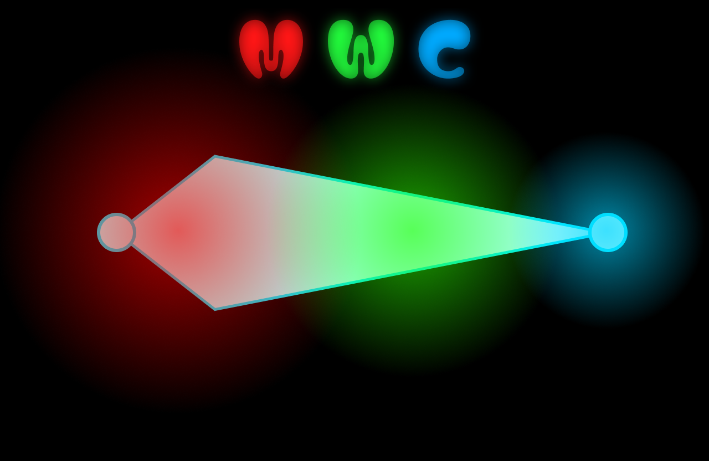

**Metaball Weight Container (MWC) 1.** **0**
Written in Russian and English

**English Version**
**Metaball Weight Container (MWC)** is a specialized tool for Blender designed for precise and rapid transfer of rigging weights from a character onto clothes, accessories, shoes, and other companion objects.
Unlike standard Blender weight transfer tools (such as *Data Transfer*), which project weights directly from surface to surface and often cause weight "bleeding" (e.g., from the torso to sleeves or between fingers), MWC uses a volumetric approach:
1. **Metaball Container Generation**: The source character mesh is converted into a volumetric cloud of virtual spheres (metaballs), each storing the weights of the influencing bones.
2. **Display and Editing**: The position, radius, and weights of the spheres can be adjusted in real-time, allowing you to evaluate the deformation quality in Pose Mode.
3. **Smart Weight Transfer**: Weights are transferred to the target clothing using mesh-edge geodesic distances, normal filtering, and final smoothing.

**Workflow Overview**
1. **Cache Generation**: Select the character in the  **Source Mesh** field, adjust the sphere scale, and click  **Create**. The addon generates the sphere cloud and saves it to a cache.
2. **Visualization and Tweaking**: Enable  **Show Preview** to see the spheres. For precise manual tuning, you can spawn them as physical objects using the  **Spawn Viewport Metaballs** button, move them, adjust their bone weights on the panel, and then click  **Save to Cache**.
3. **Transfer to Clothing**: Select the target clothing in the  **Target Mesh** field, configure the transfer parameters, and click  **Apply**.

**1. Weight Generation (1. Generation & Cache Creation)**
This section handles the analysis of the source character mesh, placing spheres based on its vertices, and writing data to a temporary cache.
- **Source Mesh**: The character mesh object with skeletal binding (Vertex Groups containing weights). Metaballs are generated based on its geometry.
- **Custom Settings**: A checkbox that unlocks advanced generation settings:
  - **Alpha (Scale)**: The base scale for the spheres' radii. Smaller values make spheres more localized, larger values make them more diffused.
  - **Subdivision Coeff (K)**: Edge subdivision coefficient. If a mesh edge is too long, the addon automatically places additional spheres along it to eliminate weight gaps (e.g., on forearms).
  - **Merge Close**: A checkbox to merge close-lying spheres of the same bone for optimization.
  - **Merge Factor**: The distance threshold for merging spheres.
  - **Joint-Aware Scaling**: A checkbox to adapt sphere radius near joints:
    - **Armature**: The character's armature skeleton object.
    - **Joint Scale Factor**: Scale multiplier for spheres near joints (bone connections).
    - **Middle Scale Factor**: Scale multiplier for spheres in the middle of long bones.
  - **Thickness-Aware Scale**: A checkbox to limit sphere radius by the local thickness of the character's body (uses raycasting).
    - **Thickness Factor**: Thickness multiplier. *Critically important for fingers: prevents spheres from expanding too wide and mixing weights between adjacent fingers.*
- **Grouping**:
  - Single Object: All spheres are created within a single family. Recommended for seamless clothing.
  - Multiple Objects: Separates spheres into independent groups based on the mesh's geometric islands (useful if buttons, belts, etc., are separated from the main body).
- **Symmetry**: Generates spheres only on the left side of the character and mirrors them to the right, automatically renaming bones (e.g., swapping .L to .R).
- **Create**: Runs the generation process and writes spheres to the cache.

**2. Weight Transfer (3. Weight Transfer & Baking)**
This section controls the calculation of spheres' influence on clothing vertices and the final baking of weights.
- **Target Mesh**: The clothing or accessory mesh object to which the weights will be transferred.
- **Custom Settings**: A checkbox that unlocks advanced transfer settings:
  - **Geodesic Distance**: Uses distance along the mesh edges (Dijkstra's algorithm) instead of straight Euclidean line-of-sight distance. *Prevents weights from bleeding in tight spaces (e.g., from the torso to a resting arm, or between fingers).*
  - **Custom Falloff Curve**: Allows you to manually adjust the spheres' influence falloff curve using Blender's built-in curve editor.
  - **Wyvill Exponent (n)**: The falloff power in the classic Wyvill formula (used if the custom curve is disabled). Higher values result in sharper sphere boundaries.
  - **Mixing Exponent (q)**: Sharpness parameter for blending weights from overlapping spheres.
  - **Threshold (tau)**: Micro-weight cutoff threshold. Any weights below this value are removed to optimize the mesh.
  - **R Falloff Coeff**: Multiplier for the spheres' maximum radius of influence.
- **Normal Filter**: Filters weights depending on how well the direction of the clothing vertex normal matches the normal of the sphere.
  - **Strictness (p)**: Strictness of the filter (higher values penalize mismatched normals more severely).
  - *[!WARNING]*
  - ***Do not enable the Normal Filter if the clothing has thickness (e.g., Solidify modifier)!*** * Due to opposite-facing normals on the inside, weight binding artifacts will occur.*
- **Smoothing**: Applies Laplacian weight smoothing across the mesh after transfer to soften transitions.
  - **Smoothing Strength**: The strength of the smoothing effect.
  - **Smoothing Iterations**: The number of smoothing passes.
- **Apply**: Calculates and bakes weights onto the target clothing.

**3. Weight Display (2. Viewport & Editing)**
This section is dedicated to weight previewing and manual adjustment.
***Viewport Object Controls***
- **Spawn Viewport Metaballs**: Spawns spheres from the cache into the scene as actual Blender metaball objects (under the MWC_Metaballs collection). They can be moved, scaled, and edited using Blender's standard tools.
- **Clear Viewport Metaballs**: Safely deletes the spawned metaball objects from the scene without affecting the saved cache file.
***Viewport Preview (GPU Rendering)***
- **Show Preview**: Enables GPU-rendered real-time preview of the spheres in the 3D Viewport. The spheres dynamically follow skeletal deformations in  **Pose Mode**.
- **Color by Active Bone**: Spheres are colored using a Weight Paint gradient (blue to red) based on the weights of the currently selected bone or vertex group.
- **Clean Look**: To minimize visual clutter, the wireframe grid is drawn in gold  **only on the selected sphere**, while other spheres are rendered as clean, smooth semi-transparent volumes.
***Active Metaball Editor (Manual Tweaking)***
Displays the properties of the currently selected metaball object from the MWC_Metaballs collection:
- **Add Metaball**: Adds a new sphere at the 3D Cursor position.
- **Snap to Cursor**: Snaps the selected sphere to the 3D Cursor position.
- **Alpha**: Radius slider for the selected sphere.
- **Bone Weights**: A list of bones and their numeric weights (from 0.0 to 1.0) assigned to the selected sphere. You can adjust weights using the sliders, delete bones with the cross button, or type in a new bone name and click the plus button.
- **Save to Cache**: Overwrites the .npz cache file with the current positions, scales, and bone weights of the edited viewport spheres.

**Русская версия**
**Metaball Weight Container (MWC)** — это инструмент для Blender, созданный для точного и быстрого переноса весов оснастки (rigging weights) с персонажа на одежду, аксессуары, обувь и другие сопутствующие объекты.
В отличие от стандартных инструментов переноса весов Blender (таких как *Data Transfer*), которые проецируют веса напрямую с поверхности на поверхность и часто допускают «протекание» весов (например, с торса на рукава или между пальцами), MWC использует объемный подход:
1. **Генерация контейнера метаболов**: Исходный меш персонажа преобразуется в объемное облако виртуальных сфер (метаболов), каждая из которых хранит веса влияющих костей.
2. **Отображение и редактирование**: Положение, радиус и веса сфер можно настраивать в реальном времени, оценивая результат деформации в режиме позы (Pose Mode).
3. **Умный перенос весов**: Веса переносятся на одежду с использованием расстояний по ребрам сетки, фильтрации по нормалям и финального сглаживания.

**Общий рабочий процесс**
1. **Генерация кэша**: Выберите персонажа в поле  **Source Mesh**, настройте масштаб сфер и нажмите  **Create**. Аддон сгенерирует облако сфер и запишет их в кэш.
2. **Визуализация и правка**: Включите  **Show Preview**, чтобы увидеть сферы. Для точной настройки вы можете спавнить их кнопкой  **Spawn Viewport Metaballs**, двигать и менять веса вручную, после чего нажать  **Save to Cache**.
3. **Перенос на одежду**: Выберите целевую одежду в поле  **Target Mesh**, настройте параметры переноса и нажмите  **Apply**.

**1. Получение весов (1. Generation & Cache Creation)**
Этот раздел отвечает за анализ исходного меша персонажа, создание облака сфер по его вершинам и запись данных во временный кэш.
- **Source Mesh (Исходный меш)**: Объект-меш персонажа, имеющий привязку к скелету (Vertex Groups с весами). На его основе создаются метаболы.
- **Custom Settings (Свои параметры)**: Чекбокс, открывающий доступ к настройкам генерации:
  - **Alpha (Scale)**: Базовый масштаб радиуса сфер. Меньшие значения делают сферы более точечными, большие — более размытыми.
  - **Subdivision Coeff (K)**: Коэффициент разбиения длинных ребер. Если ребро меша слишком длинное, аддон автоматически расставит вдоль него дополнительные сферы, чтобы исключить пустоты в весах (например, на предплечьях).
  - **Merge Close**: Чекбокс для слияния близко расположенных сфер одной кости с целью оптимизации.
  - **Merge Factor**: Порог расстояния для слияния сфер.
  - **Joint-Aware Scaling**: Чекбокс для адаптации радиуса в суставах:
    - **Armature**: Объект-скелет персонажа.
    - **Joint Scale Factor**: Коэффициент радиуса сфер в суставах (сочленениях костей).
    - **Middle Scale Factor**: Коэффициент радиуса сфер в середине длинных костей.
  - **Thickness-Aware Scale**: Чекбокс для ограничения радиуса сфер по локальной толщине тела персонажа (использует лучи/raycast).
    - **Thickness Factor**: Множитель толщины. *Критически важно для пальцев рук: предотвращает раздувание сфер и смешивание весов между соседними пальцами.*
- **Grouping (Группировка)**:
  - Single Object (Один объект): Все сферы сливаются в одно семейство. Рекомендуется для бесшовной одежды.
  - Multiple Objects (Несколько объектов): Разделяет сферы на независимые группы по геометрическим островам меша (например, если пуговицы или ремни отделены от тела).
- **Symmetry (Симметрия)**: Генерирует сферы только на левой стороне персонажа и зеркально отражает их на правую с автоматическим переименованием костей (например, .L меняется на .R).
- **Create (Создать)**: Запускает процесс генерации и записывает сферы в кэш.

**2. Перенос весов (3. Weight Transfer & Baking)**
Этот раздел управляет расчетом влияния сфер на вершины одежды и финальным запеканием весов.
- **Target Mesh (Целевой меш)**: Объект одежды или аксессуара, на который переносятся веса.
- **Custom Settings (Свои параметры)**: Чекбокс, открывающий доступ к настройкам переноса:
  - **Geodesic Distance (По ребрам)**: Использование расстояния вдоль ребер сетки (алгоритм Дейкстры) вместо Евклидова расстояния по прямой. *Предотвращает утечку весов в узких местах (например, с торса на опущенный рукав или между пальцами).*
  - **Custom Falloff Curve**: Позволяет вручную настроить кривую спада влияния сфер с помощью встроенного редактора кривых Blender.
  - **Wyvill Exponent (n)**: Степень спада влияния в классической формуле Wyvill (используется, если выключена кастомная кривая). Выше значение — жестче граница влияния сферы.
  - **Mixing Exponent (q)**: Параметр жесткости смешивания весов от перекрывающих друг друга сфер.
  - **Threshold (tau)**: Порог отсечения микро-весов. Все веса ниже этого значения удаляются для оптимизации меша.
  - **R Falloff Coeff**: Коэффициент максимального радиуса влияния сфер.
- **Normal Filter (Фильтр нормалей)**: Фильтрует веса в зависимости от того, насколько совпадает направление нормали вершины одежды с нормалью сферы.
  - **Strictness (p)**: Строгость фильтрации (чем выше, тем сильнее штрафуются несовпадающие нормали).
  - *[!WARNING]*
  - ***Не включайте фильтр нормалей, если одежда имеет толщину (например, модификатор Solidify)!*** * Из-за противоположных нормалей на внутренней стороне меша возникнут дефекты привязки.*
- **Smoothing (Сглаживание)**: Сглаживание весов Лапласом по сетке после переноса для смягчения стыков.
  - **Smoothing Strength**: Сила сглаживания.
  - **Smoothing Iterations**: Количество проходов сглаживания.
- **Apply (Применить)**: Выполняет расчет и переносит веса на одежду.

**3. Отображение весов (2. Viewport & Editing)**
Этот раздел отвечает за предварительный просмотр весов и их ручную корректировку.
***Кнопки управления кэшем в сцене***
- **Spawn Viewport Metaballs**: Спавнит сферы из кэша в сцену как реальные объекты (коллекция MWC_Metaballs). Их можно двигать, масштабировать и настраивать стандартными инструментами Blender.
- **Clear Viewport Metaballs**: Удаляет объекты сфер из сцены, не затрагивая сам кэш.
***Viewport Preview (Отображение на GPU)***
- **Show Preview (Показать превью)**: Включает отрисовку сфер в 3D Viewport силами GPU. Сферы корректно следуют за деформациями костей в  **Pose Mode** скелета.
- **Color by Active Bone**: Сферы окрашиваются в цвета весов (от синего к красному) для той кости или группы вершин, которая сейчас выделена.
- **Чистый вид**: Для снижения визуального шума сетка граней (wireframe) рисуется золотым цветом  **только на выделенной сфере**, остальные отображаются как чистые полупрозрачные объемы.
***Active Metaball Editor (Ручное редактирование)***
Показывает параметры выделенного в данный момент метабола из коллекции MWC_Metaballs:
- **Add Metaball**: Добавляет новую сферу в позицию 3D-курсора.
- **Snap to Cursor**: Перемещает выделенную сферу к 3D-курсору.
- **Alpha**: Слайдер радиуса выделенной сферы.
- **Bone Weights (Веса костей)**: Список костей и их числовых весов (от 0.0 до 1.0) для выделенной сферы. Вы можете регулировать веса слайдером, удалять кости кнопкой с крестиком или вписать имя новой кости и нажать плюс.
- **Save to Cache (Сохранить в кэш)**: Записывает все изменения, внесенные вручную в объекты сцены, обратно в файл кэша .npz.
