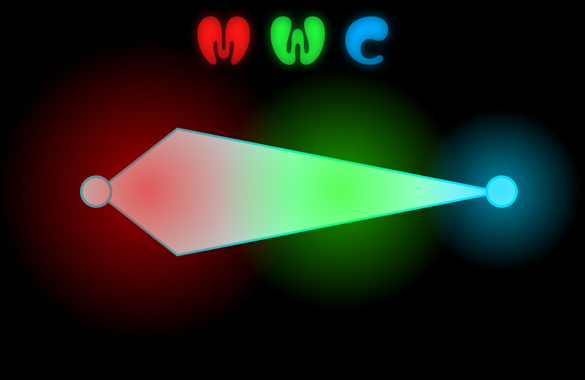

# Metaball Weight Container (MWC) 1.1

Written in Russian and English · [Полная документация на русском 🇷🇺](Full-doc.ru.md)

---

**Metaball Weight Container (MWC)** is a specialized tool for Blender designed for precise and rapid transfer of rigging weights from a character onto clothes, accessories, shoes, and other companion objects.

Unlike standard Blender weight-transfer tools (such as *Data Transfer*), which project weights directly from surface to surface and often cause weight "bleeding" (e.g., from the torso onto sleeves or between fingers), MWC uses a **volumetric approach**:

1. **Metaball Container Generation** — the source character mesh is converted into a volumetric cloud of virtual spheres (metaballs), each storing the weights of the influencing bones.
2. **Display and Editing** — position, radius, and weights of the spheres can be adjusted in real time, letting you evaluate deformation quality in Pose Mode.
3. **Smart Weight Transfer** — weights are transferred to the target clothing using mesh-edge geodesic distances, normal filtering, and final smoothing.

### Highlights (v1.1)

- **Instanced GPU preview** — thousands of spheres in one draw call with automatic LOD
- **Per-blend cache** — every `.blend` gets its own metaball container; no more cross-instance overwrites
- **Parameter presets** — save/load all generation & transfer settings as JSON presets for your garment pipeline
- **Process Pool geodesics** — multi-process Dijkstra for 100k+ vertex meshes with safe fallback

### Workflow Overview

1. **Cache Generation** — select the character in **Source Mesh**, adjust sphere scale, click **Create**.
2. **Visualization & Tweaking** — enable **Show Preview**, or spawn editable spheres with **Spawn Viewport Metaballs**, adjust them, then **Save to Cache**.
3. **Transfer to Clothing** — select the target in **Target Mesh**, configure parameters, click **Apply**.

### Videos

- [Gloves preview](https://github.com/darabon/MWC/blob/main/images/gloves-prev.mp4)
- [Hand preview](https://github.com/darabon/MWC/blob/main/images/hand-prev.mp4)

---

## Documentation

| Document | Language | Content |
|---|---|---|
| [Full-doc.md](Full-doc.md) | English | Complete reference: all panels & parameters, presets, cache system, GPU internals, performance guide, troubleshooting |
| [Full-doc.ru.md](Full-doc.ru.md) | Русский | Полный справочник: все панели и параметры, пресеты, система кэша, устройство GPU-превью, производительность, решение проблем |

## Requirements

- Blender 4.5+ (tested through 5.x)
- NumPy (bundled with Blender)

**Install:** `Edit → Preferences → Add-ons → Install…` → pick the ZIP → enable *MWC — Metaball Weight Container*. The UI appears in the N-panel under **MWC 1.1**.
